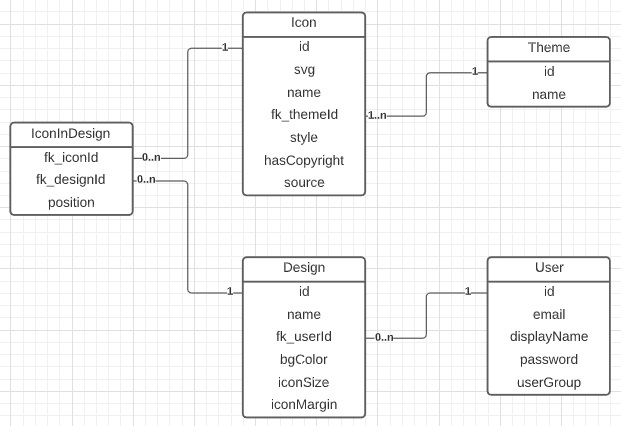
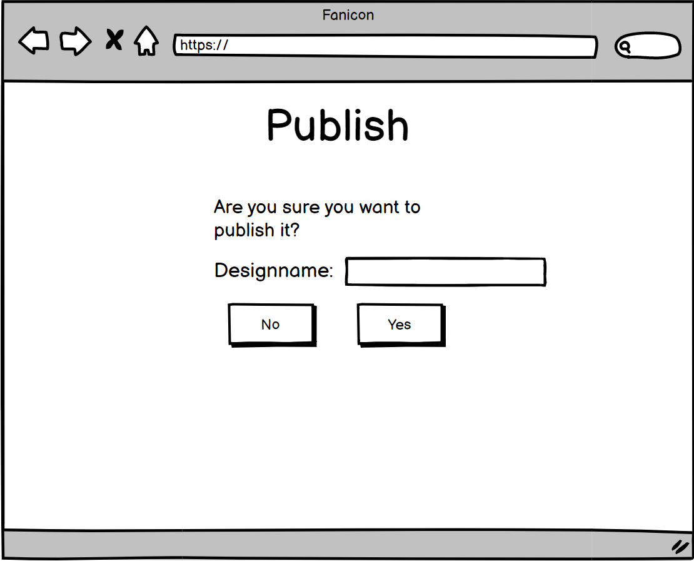
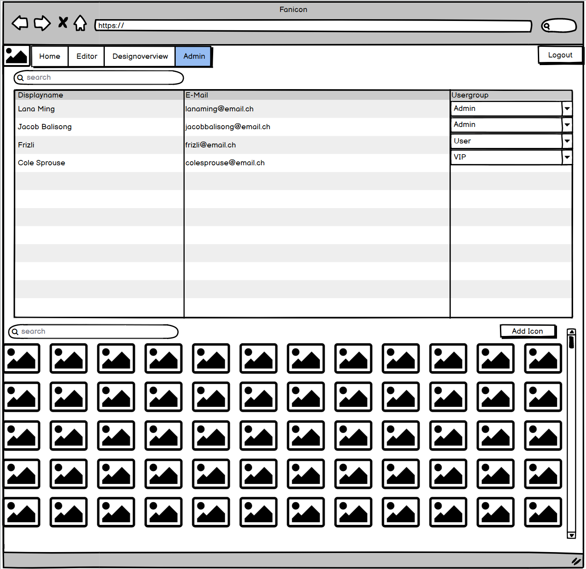

# **Projekt Fanicon**

Von Rouven Wicki &amp; Cedric Gasser

Klasse S-Inf18aL

23.04.2021

# Contents

[Starten](#Starten)

[Beschreibung](#Beschreibung)

[API](#API)

[Nutzer](#Nutzer)

[- Gruppen](#Gruppen)

[- Personas](#Personas)

[User Stories](#User-Stories)

[- Allgemein](#Allgemein)

[- Design-Editor](#Design-Editor)

[Architektur](#Architektur)

# Starten

  * `Docker`, `Docker-Compose` und `Java 11` sind vorausgesetzt
  * `cd backend; ./gradlew bootJar` backend builden
  * `docker-compose up -d` ausführen
  * [localhost](http://localhost) öffnen

# Beschreibung

Wir erstellen im M151 das Backend und im M152 das Frontend, was zusammen eine Webapp ergibt. Auf dieser Webapp soll man Icons auf einer Fläche anordnen, um sein eigenes Design zu kreieren. Die Webseite hat ein Login und eine Registrierungsfunktion.

Unsere: [Präsentation](dok/Fanicon.pdf)

# API

These are the endpoints used by our Frontend. There are a few more implemented in the Backend.

## Auth

`POST` `/auth/login` send credentials and receive sessions cookie  
`POST` `/auth/register` creates user  
`PUT` `/auth/upgrade` upgrades current normal user to vip  
`GET` `/auth/info` gets authentication info such as name or usergroup  

## Icons

`GET` `/icons` returns all Icons  
`GET` `/icons?q=sword` returns all Icons with "sword" in the Name or in the Theme Name  
`POST` `/icons` creates icon  

## Users

`GET` `/users` returns all users  

## Designs

`GET` `/designs` returns all designs  
`GET` `/users/:name/designs` returns all designs from user :name  
`GET` `/designs/:id` returns design by :id  
`POST` `/designs` send design and it either creates a design or overwrites an existing design  

# Nutzer

## Gruppen

### Normaler User

Der normale User kann aus Icons ein Design erstellen. Auch kann er Designs die andere veröffentlicht haben auswählen und für sich weiterbearbeiten. Designs werden verworfen, wenn man die Webseite verlässt.

### VIP User

Der VIP User kann auch ein Design erstellen und zusätzlich dieses abspeichern. Auch kann man als VIP User seine Designs veröffentlichen, damit andere diese suchen und verwenden können.

### Admin

Der Admin kann Icons hinzufügen und löschen. Als Admin soll man auch Designs erstellen können. Er soll auch Zugriff auf eine Liste von allen Usern haben, wo er die User filtern und suchen kann. Dort soll er auch die Nutzergruppe eines Users ändern können (Admin, VIP oder normaler User). Generell gesehen kann ein Admin alles machen was andere User auch können und mehr.

## Personas

### Lana Ming
Nutzergruppe: Admin

 

Sie ist ein Content-Creator und Designerin. Nutzt häufig unsere App, um ihre Designs und Icons hochzuladen. Sie braucht praktisch immer einen Desktop-PC und kennt sich sehr gut aus mit Computer.

### Jacob Balisong
Nutzergruppe: Admin

 

Er ist der Besitzer der App und hat diese mitentwickelt. Demensprechend hat er auch gute Computerkenntnisse. Er verwaltet hauptsächlich die User-Accounts und nutzt dazu das Admin-Interface seiner App, in welchem er alle User anzeigen kann.

### Frizli
Nutzergruppe: Normaler User

 

Der Frizli kann sich noch nicht selbst einen VIP Account kaufen. Er kennt sich aber schon genügend mit der Technik aus und erstellt gerne Designs, welche er als Hintergrund bei seinem Schul-PC einstellt.

### Cole Sprouse
Nutzergruppe: VIP User

 

Cole hat Freude an cleanen Designs und kreiert immer wieder für sich und seine Kollegen Design, welche er auch als Sticker ausdruckt und auf diverse Gegenstände wie z.B. auf seinen Laptop draufklebt. Er kennt sich ebenfalls gut mit Computern aus und braucht unsere Web-App auch am Smartphone, um ein Design seinen Kollegen zu zeigen.

# User Stories

## Allgemein

### Registrieren

Als neuer Benutzer möchte ich mich mit Vornamen, Nachname, E-Mail-Adresse und Passwort registrieren können, um Zugang zum Design-Editor zu erhalten.

### Login

Als registrierter Benutzer möchte ich mit einloggen und den Design-Editor navigieren können, um dort ein neues Icon-Design zu erstellen.

### VIP (kaufen)

Als eingeloggter Standard-Benutzer soll ich penetrant (immer wieder/aufdringlich) auf die Möglichkeit hingewiesen werden, das VIP upgrade zu kaufen, sodass ich jederzeit ganz einfach dafür Geld ausgeben kann.

### Designs von VIPs verwenden

Als User möchte ich Designs, die von VIPs erstellt und abgespeichert wurden, auswählen, um dieses dann selbst in meinem Editor zu bearbeiten und zu verwenden.

## Design-Editor

### Design erstellen

Als eingeloggter Benutzer möchte ich im Editor Icons meiner Wahl auf einer Fläche anordnen, um ein Design zu kreieren und davon einen Screenshot aufnehmen zu können.

### Design speichern als VIP

Als VIP User kann ich ein Design, welches ich erstellt habe, abspeichern, um es später weiter zu bearbeiten und auch für andere User zu veröffentlichen.

### Icon-Library

Als User im Editor kann ich effizient und schnell nach Icons suchen, um diese meinem Design hinzuzufügen.

### Anpassbare Parameter

Als User im Editor kann ich diverse Parameter wie Farbe, Grösse und Abstand etc. einstellen, um mein Design einzigartig nach meinem Geschmack zu gestallten.

### Drag &amp; Drop aus Icon-Library (Optional)

Als User im Editor kann ich Icons aus der Library oder aus dem Design per Drag &amp; Drop herumschieben, um schnell und einfach die Icons anzuordnen.

# Copyright
Das Bild welches auf der Startwebseite gebraucht wird, wurde uns von der Website zur Verfügung gestellt.

Link Webseite: https://pixabay.com/photos/mushrooms-eat-food-vegetarian-6320451/

Link Licence: https://pixabay.com/service/license/

# Architektur

Auf einem Ubuntu-Server lauft jeder teil der Applikation in einem Docker-Container wie unten beschrieben.

Name | Image
-----|------
Reverse-Proxy | `jwilder/nginx-proxy`
Fanicon-Frontend | `docker.pkg.github.com/cedric-gasser/fanicon/fanicon-frontend`
Fanicon-Backend | `docker.pkg.github.com/cedric-gasser/fanicon/fanicon-backend`
Redis Cache | `redis:6-alpine`
Postgres DB | `postgres:13-alpine`

Während dem entwickeln wird zusätzlich ein container `dpage/pgadmin4:5.2` verwendet, um die Datenbank zu inspektieren.

Folgende Technologien verwenden wir, welche für uns grösstenteils neu sind:

- Docker
- Docker-Compose
- Fanicon Backend
  - Java
  - Spring
  - Flyway
- Postgres DB
- Fanicon Frontend
  - nginx webserver
  - JavaScript
  - HTML &amp; CSS (Bootstrap)

# ERD

Hier ist bei der Design tabelle eine icon_Color spalte vom Typ VARCHAR(255) hinzu gekommen.

# Wireframe

 

Without VIP
.png)
To buy VIP
 
With VIP
.png)
If you want to Publish
 
 
If you are an Admin you are going to see this
 
If you want to add a Icon as an Admin

